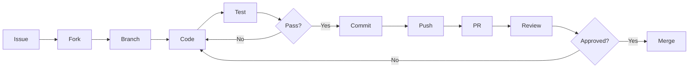

# Contributing

We love contributions from the community! Whether you're fixing a bug, adding a feature, improving documentation, or writing tests — your help makes these projects better for everyone.

---

## Table of Contents

- [Code of Conduct](#code-of-conduct)
- [What We're Looking For](#what-were-looking-for)
- [Getting Started](#getting-started)
- [Development Workflow](#development-workflow)
- [Coding Standards](#coding-standards)
- [Testing](#testing)
- [Pull Request Process](#pull-request-process)
- [Project-Specific Guides](#project-specific-guides)

---

## Code of Conduct

This project and everyone participating in it is governed by our [Code of Conduct](CODE_OF_CONDUCT.md). By participating, you are expected to uphold this code. Please report unacceptable behavior to the maintainers.

---

## What We're Looking For

| Type | Examples |
|---|---|
| **Bug Fixes** | Correcting logic errors, edge cases, security issues |
| **Features** | New endpoints, UI components, contract functions |
| **Documentation** | README updates, API docs, integration guides |
| **Tests** | Unit tests, integration tests, contract tests |
| **Design** | UI improvements, accessibility, responsive layouts |
| **Performance** | Query optimization, bundle size, caching |
| **Infrastructure** | CI/CD, Docker, deployment scripts |

---

## Getting Started

### 1. Find an Issue

Browse open issues in any repository. Look for labels:

- `good-first-issue` — Perfect for newcomers
- `help-wanted` — Active development needed
- `bug` — Confirmed bugs
- `enhancement` — Feature requests

### 2. Fork & Clone

```bash
# Fork the repository on GitHub, then:
git clone https://github.com/YOUR-USERNAME/REPOSITORY.git
cd REPOSITORY
git remote add upstream https://github.com/ayomidearegbeshola29-dev/REPOSITORY.git
```

### 3. Set Up Development Environment

#### Frontend (Next.js)

```bash
cd frontend
npm install
cp .env.example .env.local
npm run dev    # http://localhost:3000
```

#### Backend (Express + Prisma)

```bash
cd backend
npm install
cp .env.example .env
# Set up PostgreSQL and update DATABASE_URL in .env
npx prisma generate
npx prisma db push
npm run dev    # http://localhost:3001
```

#### Contracts (Soroban/Rust)

```bash
cd contracts
cargo build --target wasm32-unknown-unknown --release
cargo test
```

### 4. Create a Branch

```bash
git checkout -b feature/your-feature-name
```

Branch naming conventions:

| Prefix | Example |
|---|---|
| `feature/` | `feature/add-investor-export` |
| `fix/` | `fix/whitelist-validation-error` |
| `docs/` | `docs/api-reference-update` |
| `refactor/` | `refactor/prisma-queries` |
| `test/` | `test/contract-edge-cases` |
| `chore/` | `chore/update-dependencies` |

### 5. Make Changes

- Follow existing code style and conventions
- Keep changes focused and atomic
- Write meaningful commit messages
- Update tests and documentation

### 6. Commit

Use [Conventional Commits](https://www.conventionalcommits.org/):

```
<type>(<scope>): <description>

feat(api): add investor whitelist endpoint
fix(contract): correct compliance check ordering
docs(readme): update quick start guide
test(api): add whitelist endpoint tests
refactor(db): optimize investor queries
```

### 7. Push & Open PR

```bash
git push origin feature/your-feature-name
```

Then open a Pull Request on GitHub. Fill out the PR template completely.

---

## Development Workflow



---

## Coding Standards

### TypeScript / JavaScript

- Use **TypeScript** for all new code
- Follow existing type patterns
- Use `strict` mode
- Prefer `const` over `let`
- Use `async/await` over raw promises
- Use `import` over `require`
- Export types/interfaces separately

### React / Next.js

- Use functional components with hooks
- Use App Router for new pages
- Keep components focused and single-responsibility
- Use `'use client'` only when needed
- Extract reusable logic into hooks

### CSS / Styling

- Use Tailwind CSS utility classes
- Use `@layer components` for reusable styles
- Follow the existing design system
- Ensure responsive design
- Maintain dark theme consistency

### Express / Prisma

- Use Zod for request validation
- Use Prisma for all database access
- Return consistent error responses
- Use middleware for cross-cutting concerns
- Keep route handlers thin (logic in services)

### Rust / Soroban

- Follow Rust naming conventions
- Write comprehensive tests
- Use `testutils` for contract testing
- Document public functions
- Handle errors gracefully

---

## Testing

### Frontend

```bash
cd frontend
npm run lint    # ESLint + Next.js lint
```

### Backend

```bash
cd backend
npm test        # Run test suite
```

### Contracts

```bash
cd contracts
cargo test      # Run Rust tests
```

**Testing guidelines:**
- Write tests for all new code
- Cover edge cases and error paths
- Use meaningful test descriptions
- Keep tests independent and fast

---

## Pull Request Process

### PR Requirements

1. **Clean history** — Atomic commits with clear messages
2. **Tests** — New code should be tested
3. **Documentation** — Updated if behavior changes
4. **No merge conflicts** — Rebase on main
5. **Size** — Keep PRs focused (< 400 lines recommended)

### Review Criteria

Reviewers evaluate:

- **Correctness** — Does it work as expected?
- **Code quality** — Clean, maintainable, idiomatic?
- **Test coverage** — Adequate tests for changes?
- **Documentation** — Changes reflected in docs?
- **Performance** — Any performance concerns?
- **Security** — Any vulnerabilities introduced?

### Review Process

1. At least one maintainer must approve
2. Address all review feedback
3. Squash commits before merging
4. Delete branch after merge

---

## Project-Specific Guides

### StellarRWA

- [Frontend README](https://github.com/ayomidearegbeshola29-dev/stellarrwa/tree/main/frontend/README.md)
- [Backend README](https://github.com/ayomidearegbeshola29-dev/stellarrwa/tree/main/backend/README.md)
- [Contracts README](https://github.com/ayomidearegbeshola29-dev/stellarrwa/tree/main/contracts/README.md)

### NexDAO

- [Frontend README](https://github.com/ayomidearegbeshola29-dev/nexdao-frontend/blob/main/README.md)
- [Backend README](https://github.com/ayomidearegbeshola29-dev/nexdao-backend/blob/main/README.md)
- [Contracts README](https://github.com/ayomidearegbeshola29-dev/nexdao-contracts/blob/main/README.md)

---

## Questions?

- Open a [Discussion](https://github.com/ayomidearegbeshola29-dev/.github/discussions)
- Browse existing issues in the relevant repository
- Reach out to maintainers

---

Thank you for contributing! 🚀
