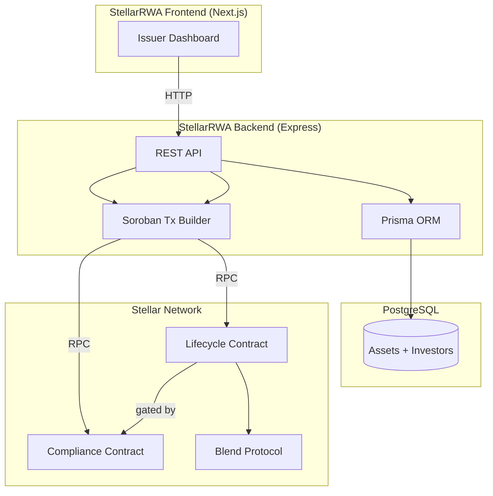
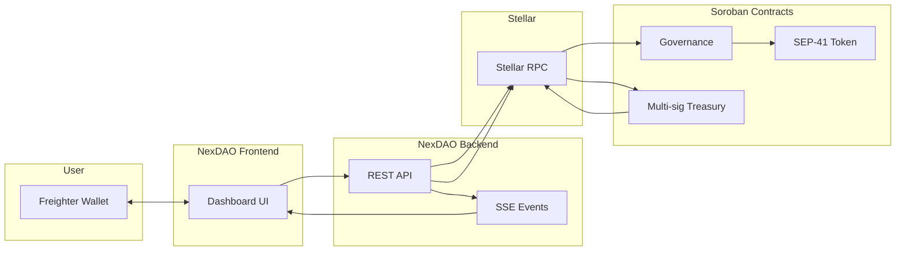
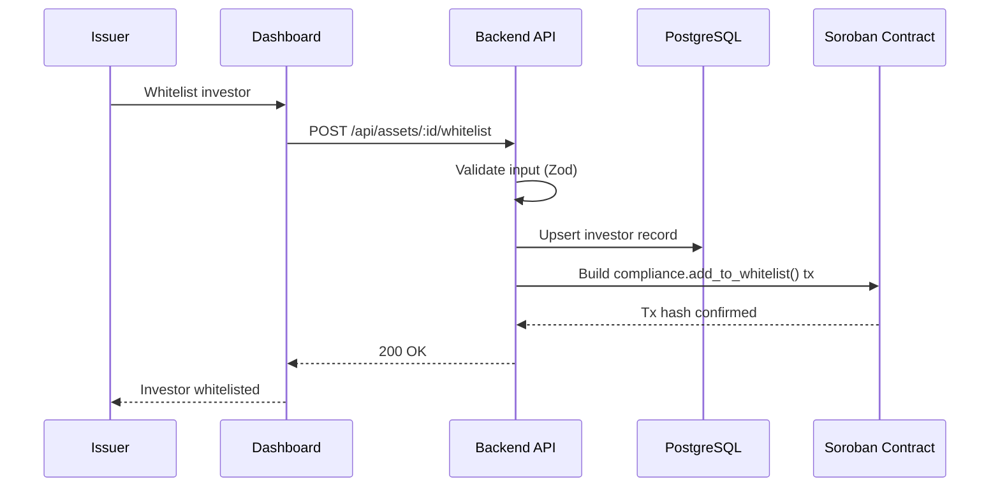
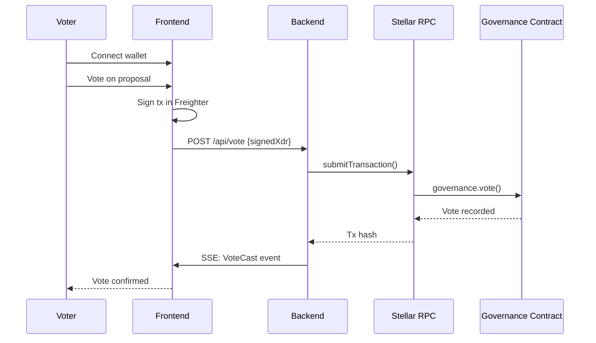
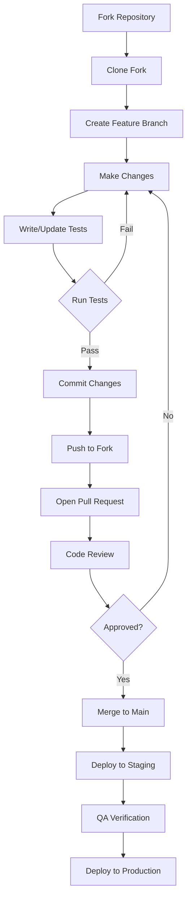

<div align="center">
  <br/>
  
  <br/>
  <h1>ayomidearegbeshola29-dev</h1>
  <p>
    <strong>Open-source Stellar ecosystem projects — RWA tokenization, DAO governance, credential verification, and more.</strong>
  </p>
  <p>
    <a href="https://github.com/ayomidearegbeshola29-dev/stellarrwa">StellarRWA</a> •
    <a href="https://github.com/ayomidearegbeshola29-dev/nexdao">NexDAO</a> •
    <a href="https://github.com/ayomidearegbeshola29-dev/Quoren">Quoren</a> •
    <a href="https://github.com/ayomidearegbeshola29-dev/Crednova">Crednova</a>
  </p>
  <p>
    
    
    
    
  </p>
  <br/>
</div>

---

## 📋 Table of Contents

- [About](#-about)
- [Projects](#-projects)
- [Architecture Overview](#-architecture-overview)
- [Tech Stack](#-tech-stack)
- [Getting Started](#-getting-started)
- [Development Workflow](#-development-workflow)
- [Contributing](#-contributing)
- [Code of Conduct](#-code-of-conduct)
- [Security](#-security)
- [License](#-license)

---

## 🎯 About

This organization builds **open-source infrastructure on the Stellar network** using Soroban smart contracts. Our projects span:

- **Real World Assets (RWA)** — Tokenized asset issuance with compliance
- **DAO Governance** — On-chain voting, treasury management, token-gated governance
- **Credential Verification** — Decentralized identity and qualification verification
- **DeFi Primitives** — Lending, staking, and economic trust protocols

All projects are designed to be **modular, composable, and production-ready** — free for the Stellar ecosystem.

---

## 📦 Projects

### Current Repositories

| Repository | Description | Stack | Status |
|---|---|---|---|
| [stellarrwa](https://github.com/ayomidearegbeshola29-dev/stellarrwa) | RWA tokenization toolkit — issue, manage, and trade compliant real-world assets | Next.js · Express · Prisma · Soroban | 🚧 Active |
| [nexdao](https://github.com/ayomidearegbeshola29-dev/nexdao) | DAO framework — on-chain voting, treasury, and token-gated governance | Next.js · Express · Prisma · Soroban | 🚧 Active |
| [nexdao-frontend](https://github.com/ayomidearegbeshola29-dev/nexdao-frontend) | NexDAO governance dashboard | Next.js · Radix UI · TanStack Query | 🚧 Active |
| [nexdao-backend](https://github.com/ayomidearegbeshola29-dev/nexdao-backend) | NexDAO REST API + Soroban integration | Express · Prisma · PostgreSQL | 🚧 Active |
| [.github](https://github.com/ayomidearegbeshola29-dev/.github) | Organization health files, templates, and documentation | Markdown | ✅ |
| [Quoren](https://github.com/ayomidearegbeshola29-dev/Quoren) | Decentralized credential verification protocol | Soroban · Rust | 🚧 Active |
| [Crednova](https://github.com/ayomidearegbeshola29-dev/Crednova) | Economic trust protocol — identity bonds, delegation, staking | Soroban · Rust | 🚧 Active |
| [Checkmate-Escrow](https://github.com/ayomidearegbeshola29-dev/Checkmate-Escrow) | Trustless chess wagering on Stellar | Soroban · React | 🚧 Active |

---

## 🏗 Architecture Overview

### StellarRWA — Real World Assets



### NexDAO — DAO Governance



### Data Flow — Whitelist Action (StellarRWA)



### Data Flow — Voting (NexDAO)



---

## 🛠 Tech Stack

### Frontend

| Technology | Used In | Purpose |
|---|---|---|
| [Next.js 14](https://nextjs.org/) | StellarRWA, NexDAO | React framework with App Router |
| [TypeScript](https://www.typescriptlang.org/) | All projects | Type-safe JavaScript |
| [Tailwind CSS](https://tailwindcss.com/) | StellarRWA, NexDAO | Utility-first styling |
| [Radix UI](https://www.radix-ui.com/) | StellarRWA, NexDAO | Accessible UI primitives |
| [TanStack Query](https://tanstack.com/query) | StellarRWA, NexDAO | Server state management |
| [Lucide React](https://lucide.dev/) | StellarRWA, NexDAO | Icon library |

### Backend

| Technology | Used In | Purpose |
|---|---|---|
| [Node.js 20](https://nodejs.org/) | StellarRWA, NexDAO | JavaScript runtime |
| [Express 4](https://expressjs.com/) | StellarRWA, NexDAO | Web framework |
| [Prisma 5](https://www.prisma.io/) | StellarRWA, NexDAO | Database ORM |
| [PostgreSQL](https://www.postgresql.org/) | StellarRWA, NexDAO | Relational database |
| [Zod](https://zod.dev/) | StellarRWA, NexDAO | Schema validation |

### Smart Contracts

| Technology | Used In | Purpose |
|---|---|---|
| [Rust](https://www.rust-lang.org/) | All Soroban projects | Smart contract language |
| [Soroban SDK](https://soroban.stellar.org/) | All Soroban projects | Stellar smart contract platform |
| [SEP-41](https://github.com/stellar/stellar-protocol) | Various | Token standard |

---

## 🚀 Getting Started

### Prerequisites

| Requirement | Version | Purpose |
|---|---|---|
| Node.js | 20+ | Frontend & Backend runtime |
| npm | 10+ | Package manager |
| PostgreSQL | 15+ | Database |
| Rust | 1.75+ | Smart contract development |
| Soroban CLI | Latest | Contract deployment |
| Freighter Wallet | Latest | Stellar wallet (browser extension) |

### Quick Start — StellarRWA

```bash
# Clone the monorepo
git clone https://github.com/ayomidearegbeshola29-dev/stellarrwa.git
cd stellarrwa

# Backend setup
cd backend
npm install
cp .env.example .env
# Edit .env with your database URL
npx prisma db push
npm run dev    # :3001

# Frontend setup (new terminal)
cd ../frontend
npm install
cp .env.example .env.local
npm run dev    # :3000
```

### Quick Start — NexDAO

```bash
# Backend
git clone https://github.com/ayomidearegbeshola29-dev/nexdao-backend.git
cd nexdao-backend
npm install
cp .env.example .env
npx prisma db push
npm run dev    # :3001

# Frontend
git clone https://github.com/ayomidearegbeshola29-dev/nexdao-frontend.git
cd nexdao-frontend
npm install
cp .env.example .env.local
npm run dev    # :3000
```

---

## 🔄 Development Workflow



### Branch Naming

| Prefix | Example | Purpose |
|---|---|---|
| `feature/` | `feature/add-asset-minting` | New features |
| `fix/` | `fix/whitelist-validation` | Bug fixes |
| `docs/` | `docs/api-reference` | Documentation |
| `refactor/` | `refactor/prisma-queries` | Code refactoring |
| `test/` | `test/contract-unit-tests` | Test additions |
| `chore/` | `chore/update-deps` | Build/config changes |

### Commit Convention

We follow [Conventional Commits](https://www.conventionalcommits.org/):

```
<type>(<scope>): <description>

feat(api): add investor whitelist endpoint
fix(contract): correct compliance check ordering
docs(readme): update quick start guide
```

---

## 🤝 Contributing

We welcome contributions of all kinds! Here's how you can help:

### What We're Looking For

- **Code** — Bug fixes, features, improvements
- **Documentation** — README updates, guides, API docs
- **Testing** — Unit tests, integration tests, contract tests
- **Design** — UI/UX improvements, diagrams, assets
- **Issues** — Bug reports, feature requests, questions

### Contribution Process

1. **Find or create an issue** — Check `good-first-issue` tags
2. **Fork the repository** — Create your own fork
3. **Create a branch** — Follow our naming convention
4. **Make your changes** — Follow existing code style
5. **Write tests** — Ensure coverage for new code
6. **Open a PR** — Fill out the PR template completely

### Code Review

All PRs require at least one approval. Reviewers check for:

- **Correctness** — Does it work as expected?
- **Quality** — Is it clean and maintainable?
- **Coverage** — Are there tests?
- **Documentation** — Are changes documented?
- **Security** — Are there vulnerabilities?

For full details, see [CONTRIBUTING.md](CONTRIBUTING.md).

---

## 📜 Code of Conduct

This organization is committed to providing a welcoming, inclusive, and harassment-free experience for everyone.

**Our standards:**
- Be respectful and empathetic
- Accept constructive feedback gracefully
- Focus on what's best for the community
- Show kindness toward others

**Unacceptable behavior:**
- Harassment, trolling, or personal attacks
- Discriminatory language or imagery
- Publishing others' private information

See [CODE_OF_CONDUCT.md](CODE_OF_CONDUCT.md) for the full text.

---

## 🔒 Security

We take security seriously. If you discover a vulnerability:

1. **DO NOT** open a public issue
2. Report via [Security Advisory](https://github.com/ayomidearegbeshola29-dev/.github/security/advisories/new)
3. Include: type, steps to reproduce, impact, suggested fix

**Response timeline:**
- 24h — Initial acknowledgment
- 7d — Assessment and confirmation
- 30d — Fix released

See [SECURITY.md](SECURITY.md) for details.

---

## 📄 License

All projects in this organization are **MIT licensed** unless otherwise noted.

```
MIT License

Copyright (c) 2026 ayomidearegbeshola29-dev

Permission is hereby granted, free of charge, to any person obtaining a copy
of this software and associated documentation files (the "Software"), to deal
in the Software without restriction, including without limitation the rights
to use, copy, modify, merge, publish, distribute, sublicense, and/or sell
copies of the Software, and to permit persons to whom the Software is
furnished to do so, subject to the following conditions:

The above copyright notice and this permission notice shall be included in all
copies or substantial portions of the Software.

THE SOFTWARE IS PROVIDED "AS IS", WITHOUT WARRANTY OF ANY KIND, EXPRESS OR
IMPLIED, INCLUDING BUT NOT LIMITED TO THE WARRANTIES OF MERCHANTABILITY,
FITNESS FOR A PARTICULAR PURPOSE AND NONINFRINGEMENT. IN NO EVENT SHALL THE
AUTHORS OR COPYRIGHT HOLDERS BE LIABLE FOR ANY CLAIM, DAMAGES OR OTHER
LIABILITY, WHETHER IN AN ACTION OF CONTRACT, TORT OR OTHERWISE, ARISING FROM,
OUT OF OR IN CONNECTION WITH THE SOFTWARE OR THE USE OR OTHER DEALINGS IN THE
SOFTWARE.
```

---

## 🗺 Roadmap

### Q2 2026
- [x] StellarRWA monorepo structure
- [x] Next.js frontend with Radix UI + Tailwind
- [x] Express backend with Prisma + PostgreSQL
- [ ] Complete compliance smart contract
- [ ] Complete lifecycle smart contract

### Q3 2026
- [ ] Blend integration for RWA collateral
- [ ] Real-time event streaming (SSE)
- [ ] Docker deployment setup
- [ ] Comprehensive test coverage

### Q4 2026
- [ ] Mainnet deployment
- [ ] Security audit
- [ ] Bug bounty program
- [ ] Community governance

---

<div align="center">
  <p>
    <sub>
      <a href="https://github.com/ayomidearegbeshola29-dev">GitHub Organization</a> •
      <a href="https://github.com/ayomidearegbeshola29-dev/.github/discussions">Discussions</a> •
      <a href="https://github.com/ayomidearegbeshola29-dev/.github/security/policy">Security</a>
    </sub>
  </p>
  <p>
    <sub>Built with ❤️ for the Stellar ecosystem</sub>
  </p>
</div>
